# Introduction

Cette présentation va démontrer comment la fédération fonctionne sur Communecter. Nous allons explorer les principales caractéristiques et fonctionnalités qui permettent une collaboration et un partage de données sans faille entre différentes entités.

## 🏛️ Qu'est-ce que la Fédération ?

La fédération, c'est comme un **réseau de villages** reliés entre eux. Chaque village (serveur) est indépendant mais peut partager des informations avec les autres.

Au lieu d’un réseau unique contrôlé par une seule entreprise (comme Facebook ou Twitter), la fédération permet à chaque serveur de communiquer librement avec les autres, sans perdre son autonomie.

## 🤔 Pourquoi utiliser la Fédération ?

### ✅ **Liberté et Indépendance**
Chacun peut choisir son serveur ou en créer un, tout en restant connecté au reste du réseau. Pas besoin d’un seul grand réseau centralisé !

### 🔄 **Interconnexion**
Vous pouvez suivre et interagir avec des utilisateurs sur d’autres serveurs, comme si tout était sur une seule plateforme.

### 🌍 **Un Internet plus ouvert et collaboratif !**
Grâce à la fédération, vous profitez d’un réseau **décentralisé**, **libre** et **interconnecté**, où chaque communauté garde son indépendance tout en restant en contact avec les autres.

## 🌐 Introduction à la Fédération sur Communecter

Aujourd’hui, la plupart des plateformes sont **centralisées** : elles appartiennent à de grandes entreprises qui contrôlent les données, les interactions et les règles du réseau. Mais il existe une autre approche : **la fédération**.

Communecter adopte ce modèle fédéré pour offrir un réseau **décentralisé, libre et ouvert**. Chaque utilisateur peut rejoindre une instance Communecter (un serveur) ou en créer une, tout en restant connecté aux autres.

Grâce à la fédération, **vous pouvez interagir avec des personnes et des contenus publiés sur d’autres serveurs**, sans être limité à une seule plateforme.

Dans les sections suivantes, nous verrons comment la fédération fonctionne dans Communecter pour les **nouvelles, les notes et les événements**, et comment elle vous permet de **partager, interagir et collaborer** à travers tout le réseau. 🚀

# Prérequis

Dans Communecter, pour pouvoir partager des nouvelles, événements, organisations, badges, etc., sur d'autres instances Communecter et même sur d'autres plateformes qui supportent ActivityPub, il faut que l'instance Communecter soit configurée pour l'ActivityPub.

Pour ce faire, il est nécessaire d'activer le module ActivityPub dans les paramètres de son compte Communecter. Voici les étapes à suivre :

- Aller sur communecter.org
- Se connecter avec son compte Communecter
- Accéder à son profil
- Aller dans les paramètres
- Activer le module ActivityPub

Vous devriez arriver sur cette page :
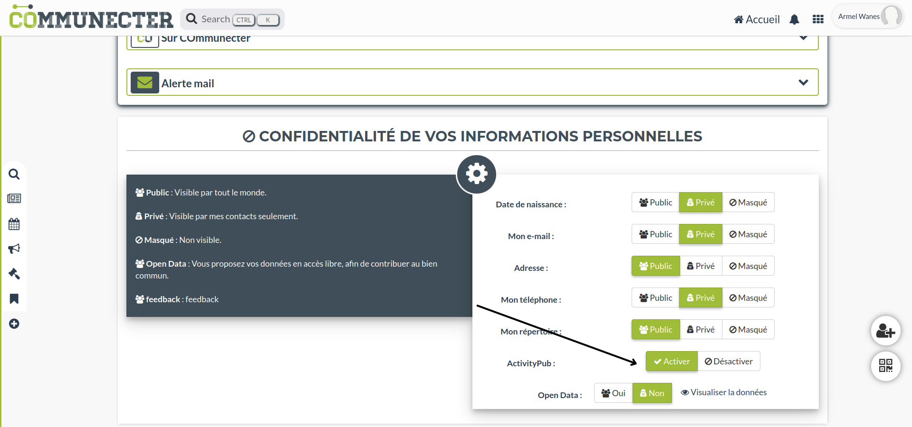

Une fois cela fait, il est nécessaire de suivre quelqu'un sur une autre instance de Communecter pour pouvoir partager des nouvelles, événements, organisations, badges, etc. Voici la procédure à suivre :

- Aller sur communecter.org
- Se connecter avec son compte Communecter
- Accéder à son profil
- Aller dans la section "Communauté"
- Accéder à la section "Réseaux externes"

Vous devriez voir cette page :
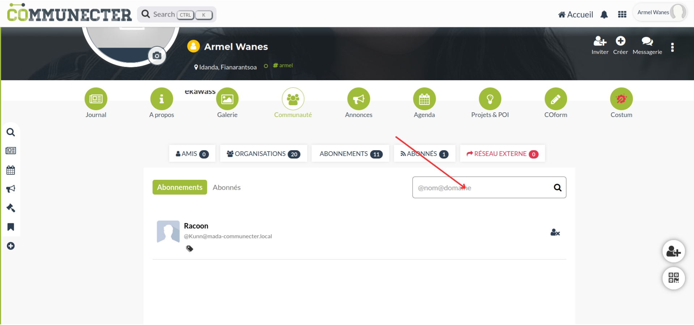

Ici, vous verrez vos abonnements et abonnés. Pour suivre quelqu'un, recherchez-le par son adresse, par exemple : @armelwanes@mastodon.social, puis cliquez sur l'icône de suivi.

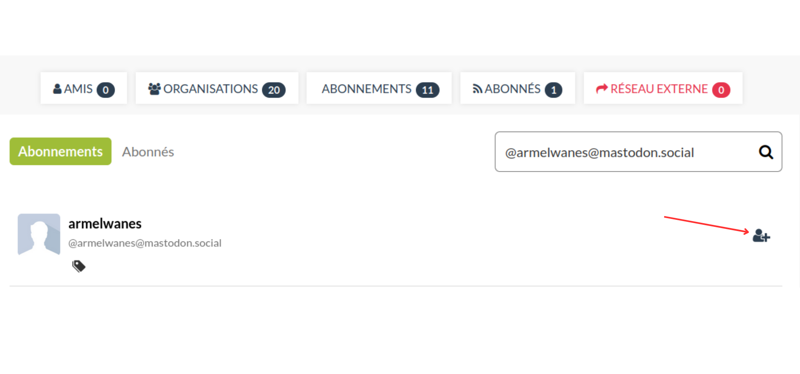

Maintenant que vous suivez quelqu'un, vous pouvez intercepter des nouvelles, événements, organisations, badges, etc., sur d'autres instances Communecter et même sur d'autres plateformes qui supportent ActivityPub, et partager ces informations avec vos abonnés.

## Fédération des Nouvelles

La fédération des nouvelles dans Communecter permet aux utilisateurs de partager l'actualité de leur communauté sur leur propre instance, grâce à l'ajout du protocole ActivityPub. Cela permet de partager des nouvelles sur d'autres instances Communecter et même sur d'autres plateformes qui supportent ActivityPub.

En général, la fédération des nouvelles comporte quatre fonctionnalités majeures :

### 1. Création des Nouvelles
Dès que vous suivez quelqu'un, vous pouvez intercepter les nouvelles publiées par les personnes que vous suivez. Par exemple, si Racoon (Kuun@mada-communecter.local) publie une nouvelle, elle sera automatiquement publiée sur votre instance Communecter.

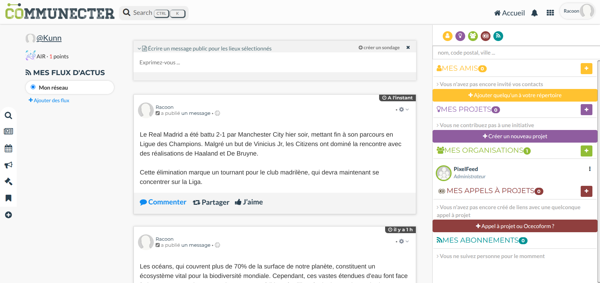

La publication de la nouvelle sur le serveur de Racoon sera visible sur votre serveur Communecter, avec une mention de l'instance d'origine.

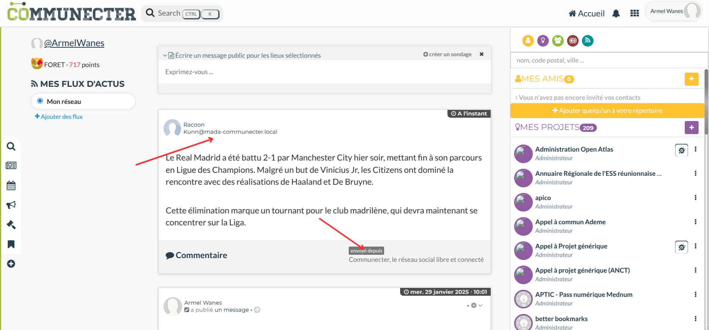

### 2. Gestion des Nouvelles
Tout changement effectué par Racoon sur son serveur Communecter sera reflété sur votre serveur :
- Si Racoon supprime une nouvelle, elle sera automatiquement supprimée de votre serveur.
- Si Racoon modifie une nouvelle, elle sera automatiquement mise à jour sur votre serveur.
- Les commentaires sur la nouvelle seront également synchronisés.

### Commentaires
Vous pouvez commenter les nouvelles sur votre serveur, et ces commentaires seront publiés sur le serveur de Racoon, combinés avec les commentaires existants.

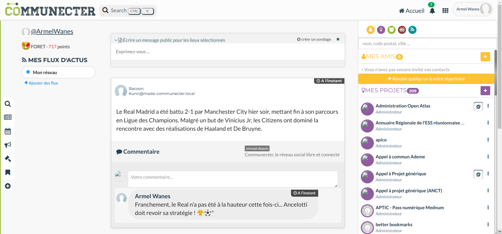

## Fédération des Événements

Dans Communecter, les événements permettent aux communautés d’organiser et de partager des activités. Chaque événement comprend une date de début, une date de fin, un lieu, une description et un organisateur. Comme pour les nouvelles, les événements peuvent être fédérés sur d’autres instances Communecter et sur des plateformes compatibles avec **ActivityPub**, comme **Mobilizon**.

### 📢 Création et Partage d’un Événement
Lorsqu’un utilisateur crée un événement sur son serveur Communecter, celui-ci peut être partagé avec les personnes qui le suivent.

**Exemple :**
Si **Armel Wanes** (*armelwanes@communecter.local*) publie un événement, toutes les personnes qui le suivent verront cet événement apparaître sur leur propre serveur Communecter.

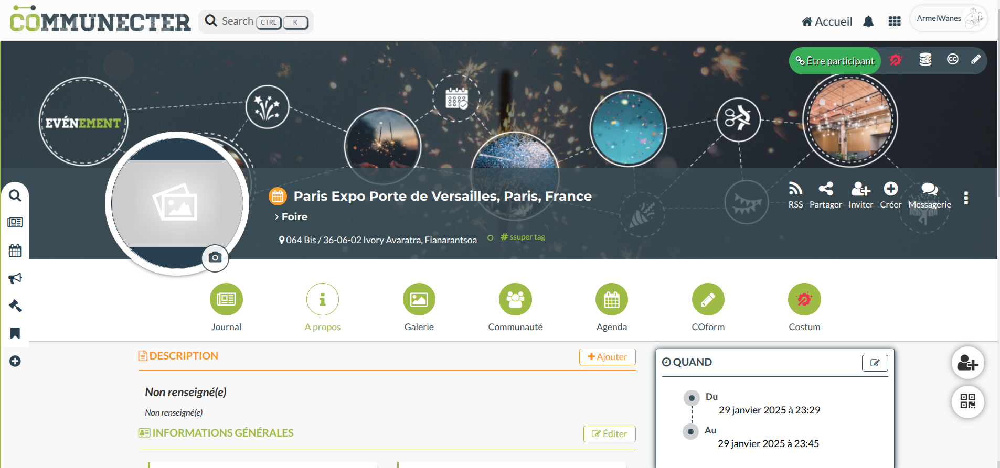

Dès que l’événement est publié, il devient visible sur votre serveur avec une mention indiquant son origine.

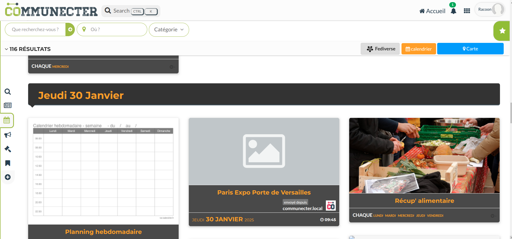

Cela permet à tout le réseau d’être informé des événements organisés, sans avoir à se rendre sur le serveur d’origine.Dans communecter l'événement est visible sur votre serveur Communecter, avec une mention de l'instance d'origine juste en dessous de celui-ci.

### 🔄 Mise à Jour et Synchronisation
Les événements restent dynamiques et peuvent être mis à jour en temps réel sur tous les serveurs concernés.

✅ **Modification de l’événement** : Si l’organisateur change la date, le lieu ou d’autres informations, ces mises à jour sont appliquées automatiquement.
✅ **Suppression de l’événement** : Si l’événement est annulé, il disparaît aussi de tous les serveurs qui le fédèrent.
✅ **Commentaires synchronisés** : Tous les échanges autour de l’événement sont visibles sur chaque instance qui le fédère.

### 🎟️ Participation et Annulation
Vous pouvez **confirmer votre participation** directement depuis votre serveur. Votre inscription sera envoyée au serveur de l’organisateur, et elle apparaîtra dans la liste des participants de l’événement.

Si vous changez d’avis, vous pouvez aussi **annuler votre participation** depuis votre propre instance, et cette information sera synchronisée partout.

Grâce à cette fédération, tout le monde peut suivre et interagir avec les événements, même s’ils sont publiés sur d’autres serveurs ! 🚀

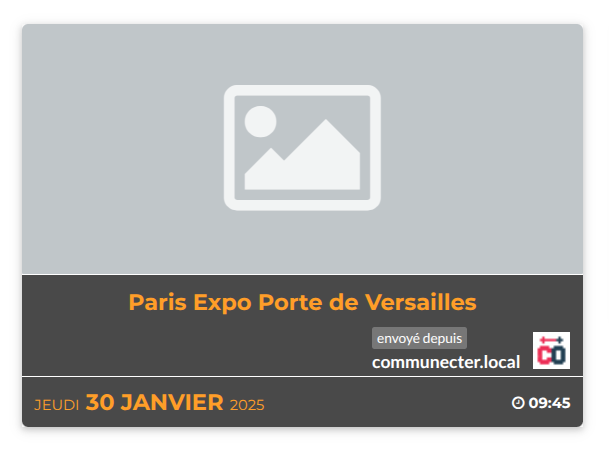

## 🏢 Fédération des Organisations

Dans Communecter, une organisation peut être une **association, une entreprise, un collectif ou toute autre structure** souhaitant interagir avec une communauté. Elle peut partager des **informations, des événements, des nouvelles et collaborer avec d’autres utilisateurs**.

Grâce à la **fédération**, une organisation n’est plus limitée à un seul serveur Communecter. Elle peut être suivie et interagir avec des membres répartis sur plusieurs instances. Cela permet une meilleure **visibilité, interconnexion et collaboration** entre communautés, même si elles sont hébergées sur des serveurs différents.

Prenon l'exemple de l'organisation "EmpowerJeunes" de **Armel Wanes** qui est hébergée sur l'instance Communecter d'**Armel Wanes** (armelwanes@communecter.local) et qui est suivie par Racoon (kuun@mada-communecter.local).

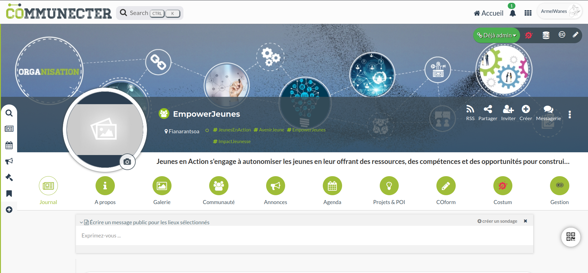

Et sur Racoon, il peut voir l'organisation "EmpowerJeunes" sur son serveur Communecter.

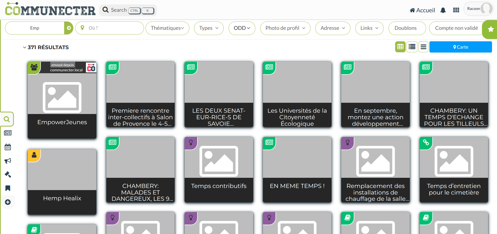
Contrairement a celui de l'organisation sur l'instance d'Armel Wanes, celui de Racoon est marqué comme étant une organisation fédérée avec l'information de l'instance d'origine.ici il est marqué "fédéré depuis communecter.local".

Et quand Racoon clique sur l'organisation "EmpowerJeunes", il arrive sur la page de l'organisation d'Armel Wanes. avec toutes les informations de l'organisation mais avec une vue minimaliste, l'organisation est toujours marquée comme étant fédérée avec l'information de l'instance d'origine.ici il est marqué "fédéré depuis communecter.local".

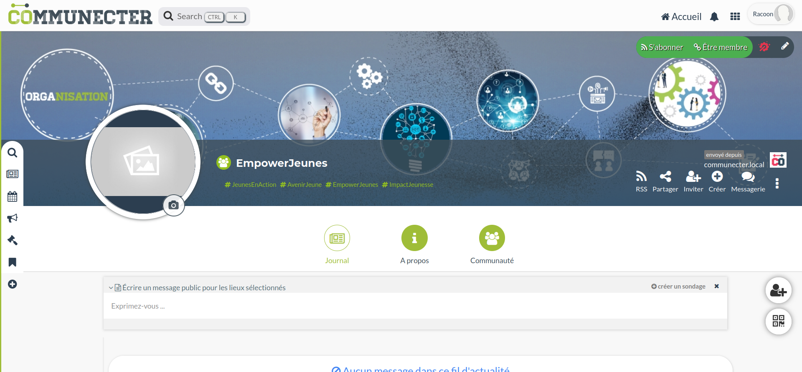

L'ajout de membre est également fédéré, si Racoon ajoute un membre à l'organisation "EmpowerJeunes", ce membre sera ajouté à l'organisation d'Armel Wanes et vice versa.
C'est a dire que je peux envoyé une invitation à un membre de l'organisation "EmpowerJeunes" de Racoon et ce membre recevra une invitation sur son serveur Communecter.

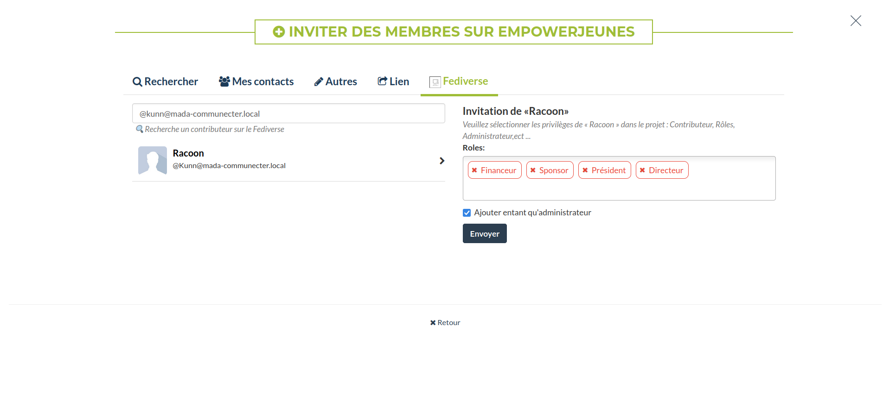

Dans la section "Membres", les membres de l'organisation sont marqués comme étant fédérés avec l'information de l'instance d'origine.Ils sont combinés avec les membres de l'organisation d'Armel Wanes. a l'inverse, si Armel Wanes supprime un membre de l'organisation "EmpowerJeunes", ce membre sera supprimé de l'organisation de Racoon et vice versa.

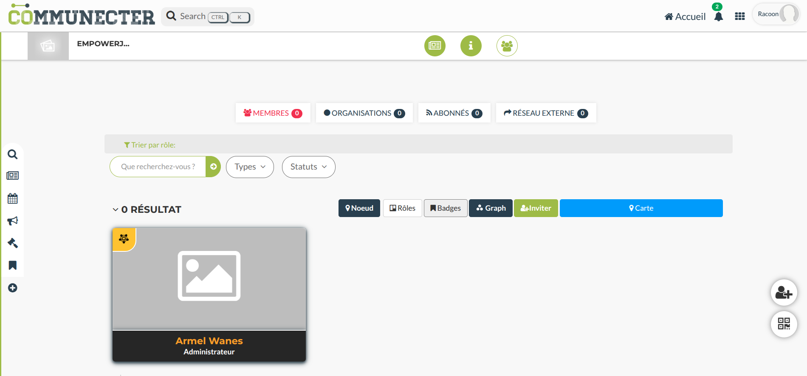

La personne invité depuis le fediverse est marquée comme étant fédérée avec l'icon du fediverse juste en haut du profil.

Comme avec les utilisateurs, les organisations peuvent être suivies par d'autres utilisateurs et vice versa.
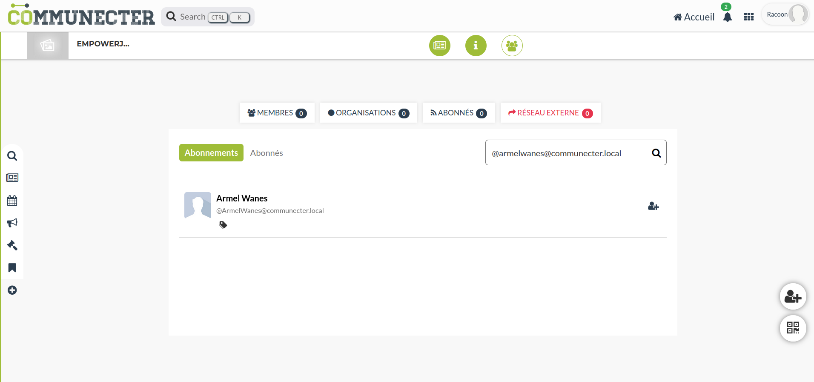

### 🎯 **Pourquoi suivre une organisation fédérée ?**
✔️ **Rester informé** : Recevez toutes ses actualités en temps réel.
✔️ **Interagir sans restriction** : Commentez, réagissez et participez aux événements, même si l’organisation est sur un autre serveur.
✔️ **Faciliter la collaboration** : Connectez-vous avec des structures similaires et développez des synergies au-delà de votre propre instance.
✔️ **Encourager la transparence** : Les organisations restent ouvertes et accessibles aux membres des autres communautés.

## 🏗️ Actions Disponibles pour les Organisations

La fédération des organisations permet **une gestion flexible et dynamique** de votre structure sur Communecter. Voici toutes les actions disponibles :

### 📌 **Création et gestion d'une organisation**
✅ **Créer une organisation** : Lancez et structurez votre propre organisation sur la plateforme.
✅ **Mettre à jour une organisation** : Modifiez les informations et gardez votre organisation à jour.
✅ **Gérer les rôles et responsabilités** : Définissez des administrateurs et des membres actifs pour organiser votre structure.

### 👥 **Interaction avec les membres**
✅ **Inviter des utilisateurs** : Envoyez des invitations pour agrandir votre communauté.
✅ **Accepter une invitation** : Rejoignez des organisations qui vous intéressent en un clic.
✅ **Devenir membre d’une organisation** : Engagez-vous dans des projets collectifs et participez activement.
✅ **Quitter une organisation** : Gérez vos engagements en toute liberté.

### 🔑 **Gestion des rôles et permissions**
✅ **Attribuer des rôles** : Offrez des responsabilités aux membres en fonction de leur implication.
✅ **Ajouter un administrateur** : Donnez à d’autres membres les moyens d’administrer l’organisation.
✅ **Supprimer des privilèges d’administrateur** : Révisez les rôles pour assurer une gestion équilibrée.
✅ **Accepter une demande d’administrateur** : Autorisez des membres à aider à la gestion de l’organisation.

### 🗑️ **Modération et gestion des membres**
✅ **Supprimer un membre** : Maintenez une équipe efficace et engagée en régulant l’accès.

## 🚀 Pourquoi fédérer les organisations ?

La fédération des organisations permet d’avoir un **écosystème ouvert, dynamique et collaboratif**. Elle offre :

🔹 **Un réseau interconnecté** : Les organisations ne sont plus limitées à un seul serveur.
🔹 **Une meilleure visibilité** : Atteignez un public plus large, au-delà de votre instance locale

Grâce à Communecter, **vos organisations ne sont plus isolées, elles font partie d’un réseau global et interconnecté !** 🌍💡

## 🏅 Fédération des Badges

Les badges dans Communecter sont des **récompenses** symboliques attribuées aux utilisateurs pour leurs **contributions** et leur **engagement** au sein de la communauté. Ces distinctions valorisent les actions positives et encouragent la participation active.

### 🤝 Qu'est-ce que la Fédération des Badges ?
La fédération des badges permet aux utilisateurs de **recevoir des badges** d'autres instances Communecter et de les afficher sur leur profil. Cela crée un réseau de reconnaissance et d'engagement partagé, où les contributions des utilisateurs sont visibles au-delà de leur instance d'origine.

Prenon l'exemple de **Racoon** (kuun@mada-communecter.local) qui reçoit un badge depuis le serveur Communecter d'**Armel Wanes** (armelwanes@communecter.local).

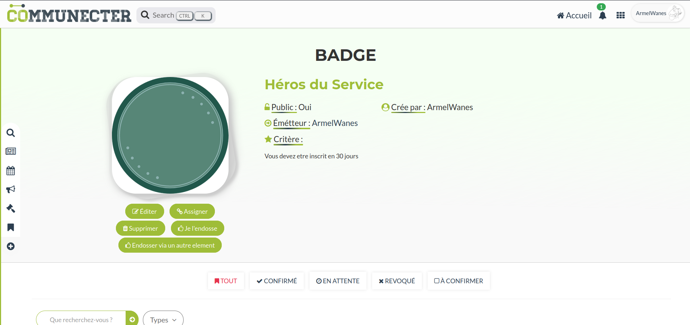

Depuis Racoon, il peut voir le badge sur son instance Communecter.

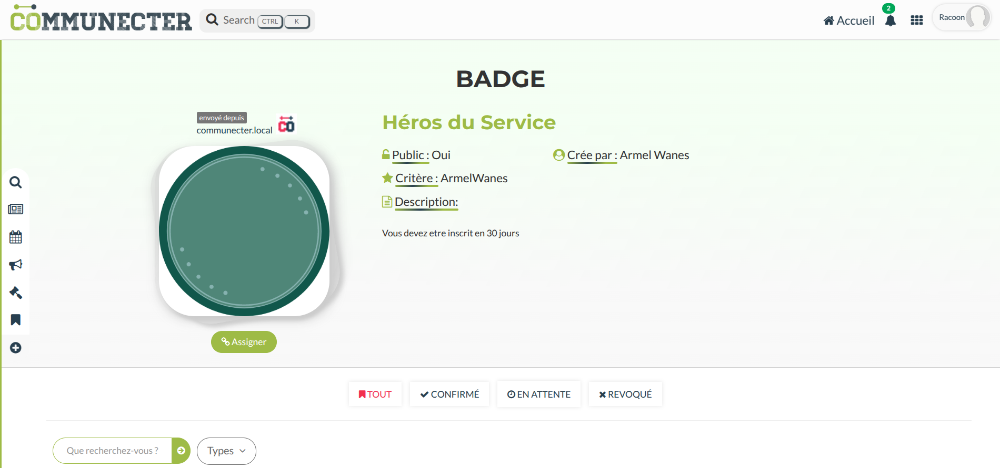
Contrairement a l'affichage du badge sur l'instance d'Armel Wanes, celui de Racoon est marqué comme étant un badge fédéré avec l'information de l'instance d'origine.ici il est marqué "fédéré depuis communecter.local".

et on peu assigné un badge a un utilisateur de l'instance d'Armel Wanes. et du coup il sera visible sur le serveur de Racoon et vice versa, on peut le voir juste en dessous du badge.

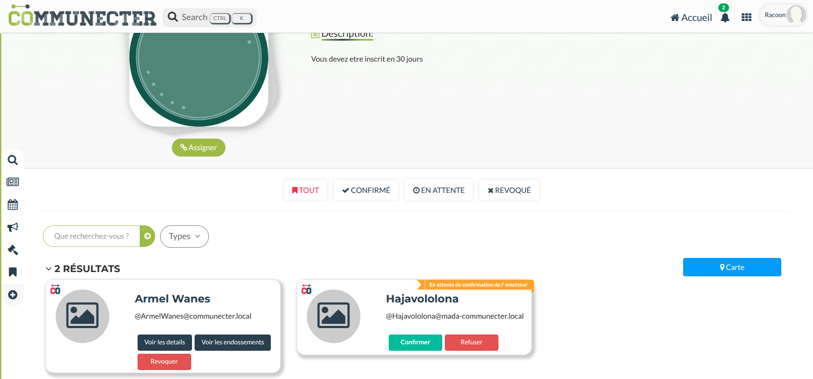
Les utilisateurs du fédiverse peuvent voir les badges assignés a un utilisateur de l'instance d'Armel Wanes du fédiverse, les utilisateurs qui a recu du badge depuis le fediverse est specifié par l'icon du fediverse juste en haut du profil.

### 🛠️ Gestion des Badges

Lorsque vous recevez un badge d'une autre instance, il est **automatiquement ajouté à votre profil**, renforçant ainsi votre réputation et votre visibilité au sein de la communauté. Vous pouvez ainsi démontrer vos compétences et votre engagement à travers des badges qui reflètent vos réalisations.

### ✅ Fonctions Disponibles pour la Gestion des Badges

La fédération des badges propose plusieurs fonctionnalités pour gérer les récompenses attribuées aux utilisateurs :

- **Création de badge** : Créez des badges personnalisés pour récompenser des actions spécifiques.
- **Mise à jour de badge** : Modifiez les détails ou les critères d'attribution d'un badge existant.
- **Attribution de badge** : Offrez des badges aux utilisateurs en reconnaissance de leurs efforts.
- **Confirmation de badge** : Validez l'attribution d'un badge pour assurer son authenticité.
- **Révocation de badge** : Retirez un badge en cas d'abus ou de non-respect des critères.
- **Refus de badge** : Rejetez une demande d'attribution de badge si elle ne répond pas aux standards.
- **Suppression de badge** : Supprimez un badge de l'historique d'un utilisateur si nécessaire.
- **Auto-attribution de badge** : Permettre aux utilisateurs d'attribuer eux-mêmes des badges en fonction de leurs réalisations

### 🌟 Pourquoi utiliser la Fédération des Badges ?
La fédération des badges favorise :
🔹 **L'interaction entre utilisateurs** : Les badges d'autres instances renforcent les connexions et l'engagement.
🔹 **La reconnaissance** : Chaque badge est un témoignage de l'implication de l'utilisateur, ce qui valorise leurs contributions.
🔹 **Une communauté dynamique** : En récompensant les utilisateurs, on encourage une participation active et collaborative.

Avec la fédération des badges sur Communecter, vos efforts sont **visibles et valorisés**, créant un environnement où chaque contribution compte et est reconnue ! 🏆

## 🌟 Projets

Dans Communecter, les projets sont des **initiatives collaboratives** qui rassemblent des utilisateurs autour d'objectifs communs. Que ce soit pour organiser un événement, lancer une campagne ou développer une idée, les projets permettent d’unir les forces et les compétences de chacun.

La **fédération des projets** offre aux utilisateurs la possibilité de **suivre et de participer à des projets** sur d'autres instances Communecter. Cela enrichit l'expérience de collaboration, en permettant des synergies entre différentes communautés.

Prenon l'exemple de **Racoon** (kuun@mada-communecter.local) qui suit un projet de **Armel Wanes** (armelwanes@communecter.local).

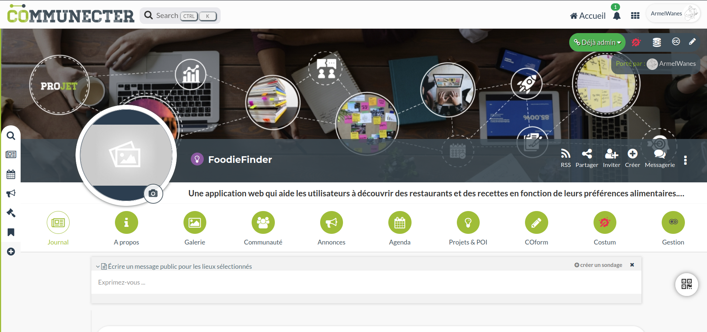

Depuis Racoon, il peut voir le projet sur son instance Communecter.

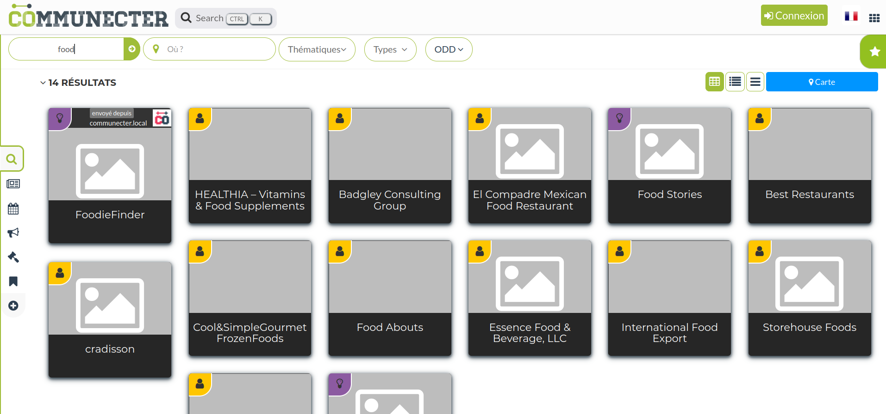

Contrairement a l'affichage du projet sur l'instance d'Armel Wanes, celui de Racoon est marqué comme étant un projet fédéré avec l'information de l'instance d'origine.ici il est marqué "fédéré depuis communecter.local".
Et si Racoon clique sur le projet, il arrive sur la page du projet d'Armel Wanes avec un vue minimaliste et le projet est marqué comme étant un projet fédéré avec l'information de l'instance d'origine.ici il est marqué "fédéré depuis communecter.local".
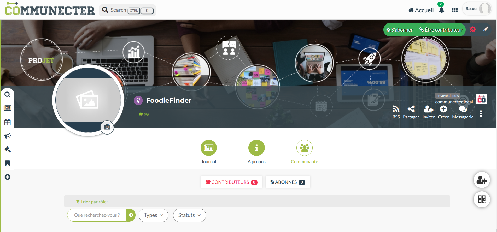

Comme avec l'organisation, on peut invité un utilisateur a participer a un projet depuis le fediverse.
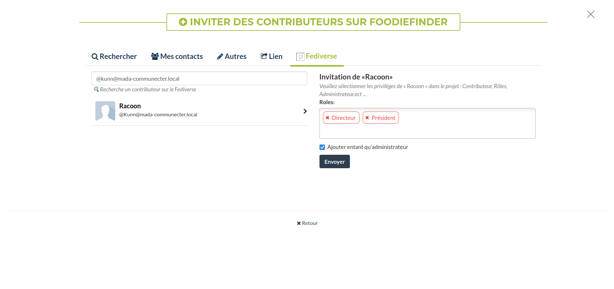

Et dans la section "Contributeurs", les contributeurs du projet sont marqués comme étant fédérés avec l'information de l'instance d'origine.Ils sont combinés avec les contributeurs du projet d'Armel Wanes. a l'inverse, si Armel Wanes supprime un contributeur du projet "FoodFinder", ce contributeur sera supprimé de l'organisation de Racoon et vice versa.

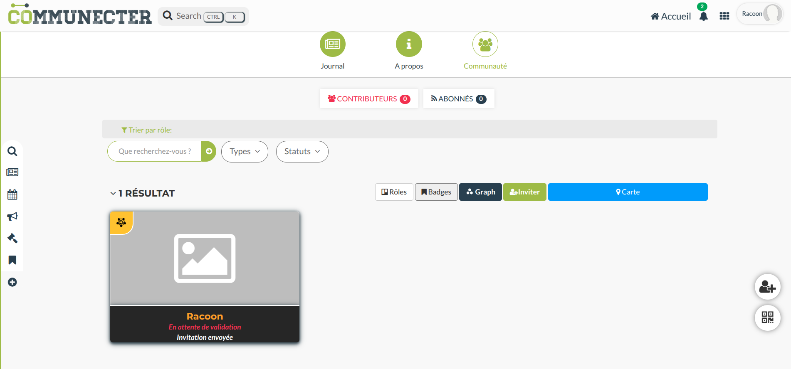

### 🛠️ Gestion des Projets

- **Création de projet** : Lancez des projets collaboratifs en définissant des objectifs clairs.
- **Mise à jour de projet** : Modifiez les informations du projet pour tenir tout le monde au courant des avancées.
- **Suppression de projet** : Retirez un projet lorsqu'il n'est plus pertinent ou nécessaire.
- **Invitation d'un contributeur** : Invitez d'autres utilisateurs à participer à votre projet pour enrichir les compétences disponibles.
- **Devenir contributeur** : Engagez-vous dans un projet et apportez votre expertise ou votre temps.
- **Acceptation de la demande de contribution** : Validez les demandes des utilisateurs souhaitant rejoindre votre projet.
- **Acceptation de la demande d'administrateur** : Accueillez des membres souhaitant prendre des responsabilités de gestion.
- **Attribution des rôles du projet** : Définissez les rôles des contributeurs pour structurer les responsabilités.
- **Ajout d'un administrateur** : Donnez des droits d'administration à des membres de confiance pour faciliter la gestion.
- **Suppression des privilèges d'administrateur** : Révisez les rôles d'administration en fonction de l'engagement des membres.
- **Quitter un projet** : Retirez-vous d'un projet si vos priorités changent.
- **Suppression d'un contributeur** : Maintenez l'engagement en retirant des membres non actifs.
- **Demande d'administration** : Permettre aux utilisateurs de faire une demande pour obtenir des droits d'administrateur sur un projet.
- **Suivre un projet** : Recevez des notifications et mises à jour sur les activités d'un projet pour rester informé.

### 🌍 Pourquoi participer à des projets fédérés ?
La fédération des projets favorise :
🔹 **L'échange d'idées** : Collaborez avec des utilisateurs d'autres instances pour enrichir vos projets.
🔹 **La synergie des compétences** : Rassemblez des talents variés pour atteindre des objectifs communs.
🔹 **La flexibilité et l'ouverture** : Profitez d'une structure de projet adaptable et accessible, quel que soit le serveur sur lequel vous vous trouvez.

Avec Communecter, les projets ne sont pas seulement locaux ; ils font partie d'un réseau global, permettant à chaque utilisateur de contribuer à des initiatives significatives au-delà des frontières des instances. Ensemble, faisons avancer nos idées et réalisons des projets collectifs ! 🚀

Cette présentation vous a permis de découvrir comment la fédération fonctionne sur Communecter, en mettant l'accent sur les nouvelles, les événements, les organisations, les badges et les projets. Nous espérons que cela vous aidera à mieux comprendre et à tirer parti de ces fonctionnalités.
