# Introduction

This presentation will demonstrate how federation works on Communecter. We will explore the main features and functionalities that enable seamless collaboration and data sharing between different entities.

## 🏛️ What is Federation?

Federation is like a **network of villages** connected to each other. Each village (server) is independent but can share information with others.

Instead of a single network controlled by one company (like Facebook or Twitter), federation allows each server to communicate freely with others while maintaining its autonomy.

## 🤔 Why Use Federation?

### ✅ **Freedom and Independence**
Everyone can choose their server or create one while staying connected to the rest of the network. No need for a single centralized network!

### 🔄 **Interconnection**
You can follow and interact with users on other servers as if everything was on a single platform.

### 🌍 **A More Open and Collaborative Internet!**
Thanks to federation, you benefit from a **decentralized**, **free**, and **interconnected** network, where each community maintains its independence while staying in contact with others.

## 🌐 Introduction to Federation on Communecter

Today, most platforms are **centralized**: they belong to large companies that control the data, interactions, and network rules. But there's another approach: **federation**.

Communecter adopts this federated model to offer a **decentralized, free, and open** network. Each user can join a Communecter instance (server) or create one while staying connected to others.

Thanks to federation, **you can interact with people and content published on other servers** without being limited to a single platform.

In the following sections, we'll see how federation works in Communecter for **news, notes, and events**, and how it allows you to **share, interact, and collaborate** across the entire network. 🚀

# Prerequisites

In Communecter, to share news, events, organizations, badges, etc., on other Communecter instances and even on other platforms that support ActivityPub, the Communecter instance must be configured for ActivityPub.

To do this, you need to activate the ActivityPub module in your Communecter account settings. Here are the steps:

- Go to communecter.org
- Log in with your Communecter account
- Access your profile
- Go to settings
- Activate the ActivityPub module

You should arrive at this page:
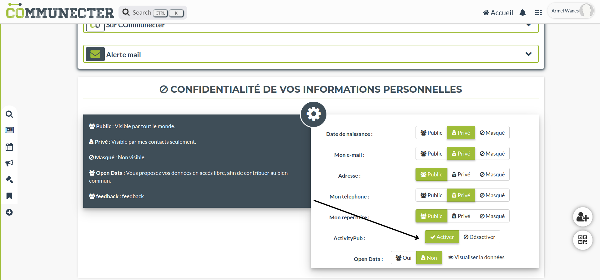

Once this is done, you need to follow someone on another Communecter instance to be able to share news, events, organizations, badges, etc. Here's the procedure:

- Go to communecter.org
- Log in with your Communecter account
- Access your profile
- Go to the "Community" section
- Access the "External Networks" section

You should see this page:

Here, you'll see your subscriptions and followers. To follow someone, search for them by their address, for example: @armelwanes@mastodon.social, then click on the follow icon.

Now that you're following someone, you can intercept news, events, organizations, badges, etc., on other Communecter instances and even on other platforms that support ActivityPub, and share this information with your followers.

## News Federation

News federation in Communecter allows users to share their community's news on their own instance, thanks to the addition of the ActivityPub protocol. This enables sharing news on other Communecter instances and even on other platforms that support ActivityPub.

Generally, news federation has four major features:

### 1. News Creation
Once you follow someone, you can intercept news published by the people you follow. For example, if Racoon (Kuun@mada-communecter.local) publishes news, it will automatically be published on your Communecter instance.

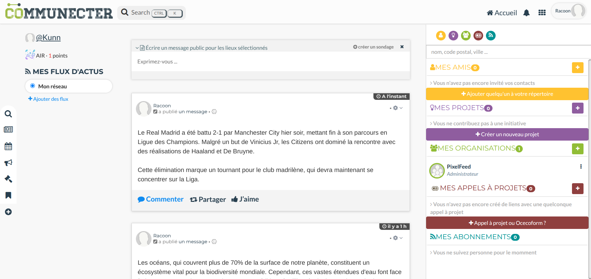

The news publication on Racoon's server will be visible on your Communecter server, with a mention of the original instance.

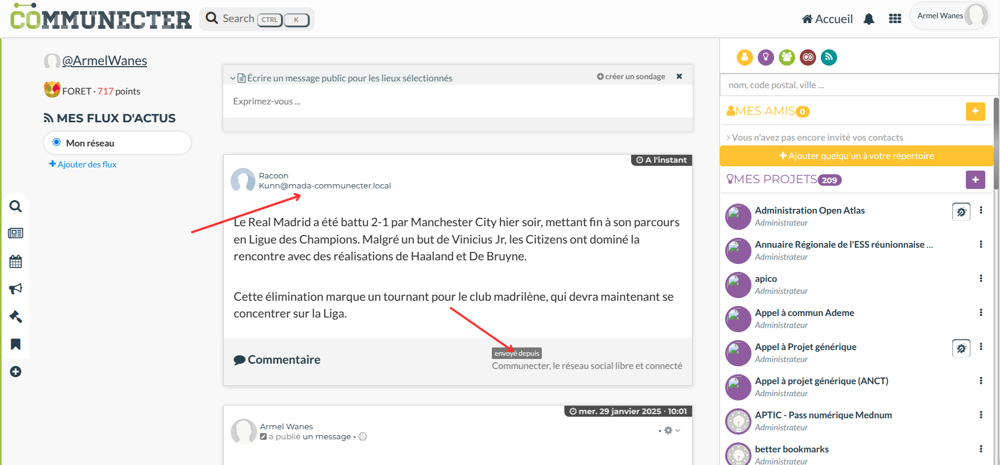

### 2. News Management
Any changes made by Racoon on their Communecter server will be reflected on your server:
- If Racoon deletes news, it will automatically be deleted from your server.
- If Racoon modifies news, it will automatically be updated on your server.
- Comments on the news will also be synchronized.

### 3. Federation with Mastodon
Communecter can also interact with Mastodon instances through ActivityPub. This means:

#### From Communecter to Mastodon
- When you publish news on Communecter, it can be shared on Mastodon
- Your Mastodon followers will see your Communecter news in their timeline
- They can interact with your content through likes and boosts

#### From Mastodon to Communecter
- You can follow Mastodon accounts from your Communecter instance
- Mastodon posts will appear in your Communecter news feed
- You can interact with Mastodon content directly from Communecter

#### Example Scenario
Let's follow a concrete example with **Armel Wanes** who uses both Communecter (armelwanes@communecter.local) and Mastodon (@armelwanes@mastodon.social):
Armel Wanes' account on mastodon.social (https://mastodon.social/@armelwanes)

When Armel Wanes publishes news on Communecter, it is automatically published on their Mastodon.social account.

Similarly, on mastodon.social, if Armel Wanes publishes news, it is automatically published on their Communecter account.

My comments on Armel Wanes' news (@armelwanes@mastodon.social) are automatically published on Mastodon.social.

Likewise, if someone comments on Armel Wanes' news on Mastodon.social, the comment is automatically published on Communecter and I will see it.

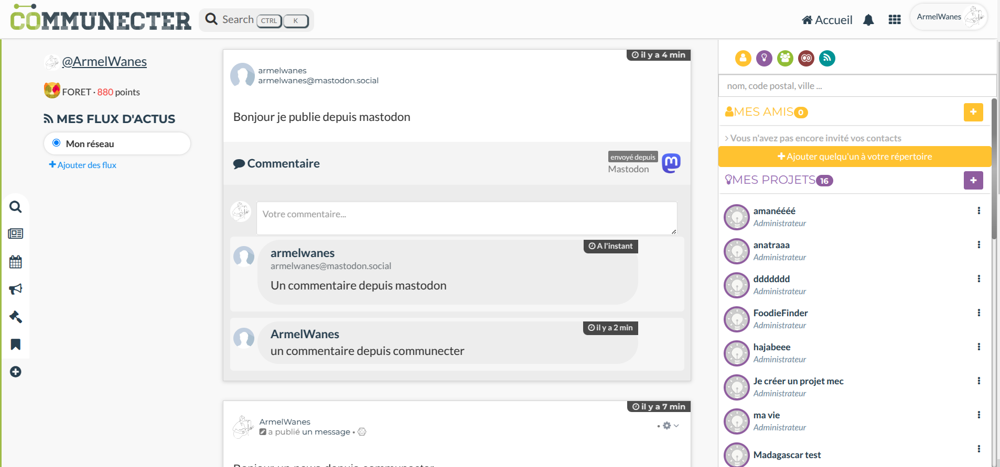

### Comments
You can comment on news on your server, and these comments will be published on Racoon's server, combined with existing comments.

## Events Federation

In Communecter, events allow communities to organize and share activities. Each event includes a start date, end date, location, description, and organizer. Like news, events can be federated on other Communecter instances and platforms compatible with **ActivityPub**, such as **Mobilizon**.

### 📢 Creating and Sharing an Event
When a user creates an event on their Communecter server, it can be shared with people who follow them.

**Example:**
If **Armel Wanes** (*armelwanes@communecter.local*) publishes an event, all people following them will see this event appear on their own Communecter server.

As soon as the event is published, it becomes visible on your server with a mention indicating its origin.

This allows the entire network to be informed of organized events without having to visit the original server. In Communecter, the event is visible on your Communecter server, with a mention of the original instance just below it.

### 🔄 Update and Synchronization
Events remain dynamic and can be updated in real-time on all concerned servers.

✅ **Event modification**: If the organizer changes the date, location, or other information, these updates are automatically applied.
✅ **Event deletion**: If the event is cancelled, it also disappears from all servers federating it.
✅ **Synchronized comments**: All exchanges around the event are visible on each instance federating it.

### 🎟️ Participation and Cancellation
You can **confirm your participation** directly from your server. Your registration will be sent to the organizer's server, and it will appear in the event's participant list.

If you change your mind, you can also **cancel your participation** from your own instance, and this information will be synchronized everywhere.

Thanks to this federation, everyone can follow and interact with events, even if they're published on other servers! 🚀

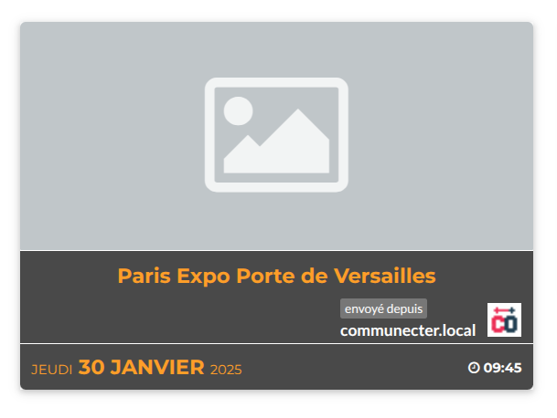

### 🔄 Federation with Mobilizon

Communecter can federate with Mobilizon, another platform specialized in event organization. Here's how it works:

#### From Communecter to Mobilizon
- Events created on Communecter can be visible on Mobilizon
- Mobilizon users can see event details and participate
- Updates to the event on Communecter are synchronized with Mobilizon

#### From Mobilizon to Communecter
- You can follow Mobilizon events from your Communecter instance
- Mobilizon events appear in your Communecter calendar
- You can participate in Mobilizon events directly from Communecter

#### Test Example with Mobilizon
We have a test group on Mobilizon (https://mobilizon.fr/@armelwanesgroup) to test the federation with Mobilizon.
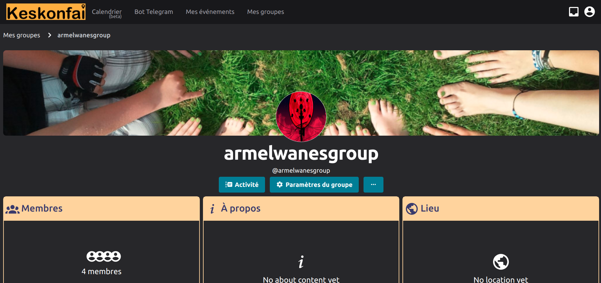
To be able to follow an event on Mobilizon, you must first follow the group on Mobilizon, following the group allows you to receive the group's events on your Communecter.
To follow the group, it's the same procedure as following a user (e.g., @armelwanesgroup@mobilizon.fr).

Now that we have followed the group, we can follow the group's events.
When an event is published on Mobilizon, it is automatically published on your Communecter.

sur communecter The event is visible on your Communecter with a mention of the original instance.

## 🏢 Organizations Federation

In Communecter, an organization can be an **association, company, collective, or any other structure** wishing to interact with a community. It can share **information, events, news, and collaborate with other users**.

Thanks to **federation**, an organization is no longer limited to a single Communecter server. It can be followed and interact with members spread across several instances. This allows better **visibility, interconnection, and collaboration** between communities, even if they are hosted on different servers.

Let's take the example of the "EmpowerJeunes" organization by **Armel Wanes** which is hosted on **Armel Wanes**'s Communecter instance (armelwanes@communecter.local) and is followed by Racoon (kuun@mada-communecter.local).

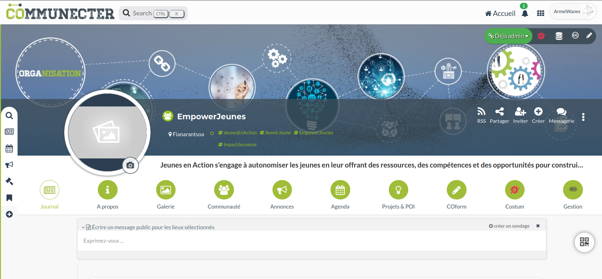

And on Racoon, they can see the "EmpowerJeunes" organization on their Communecter server.

Unlike the organization display on Armel Wanes's instance, Racoon's is marked as a federated organization with the original instance information. Here it is marked "federated from communecter.local".

And when Racoon clicks on the "EmpowerJeunes" organization, they arrive on Armel Wanes's organization page with all the organization's information but with a minimalist view, the organization is still marked as federated with the original instance information. Here it is marked "federated from communecter.local".

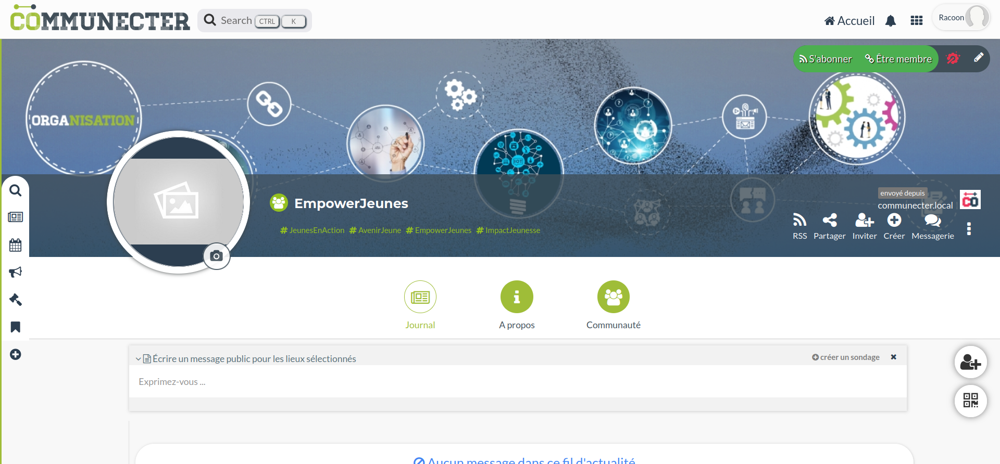

Member addition is also federated. If Racoon adds a member to the "EmpowerJeunes" organization, this member will be added to Armel Wanes's organization and vice versa.
This means I can send an invitation to a member of Racoon's "EmpowerJeunes" organization and this member will receive an invitation on their Communecter server.

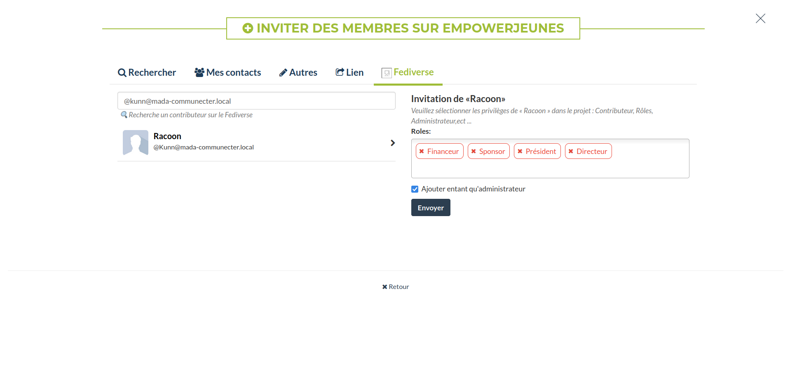

In the "Members" section, organization members are marked as federated with the original instance information. They are combined with Armel Wanes's organization members. Conversely, if Armel Wanes removes a member from the "EmpowerJeunes" organization, this member will be removed from Racoon's organization and vice versa.

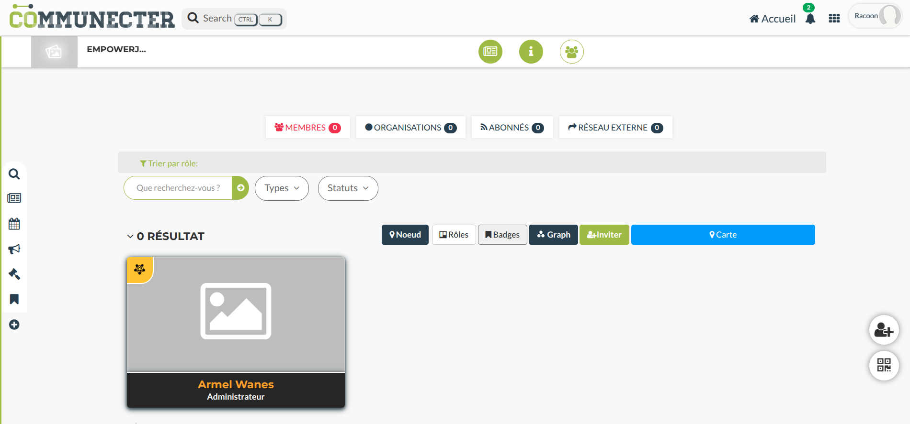

The person invited from the fediverse is marked as federated with the fediverse icon just above the profile.

Like with users, organizations can be followed by other users and vice versa.
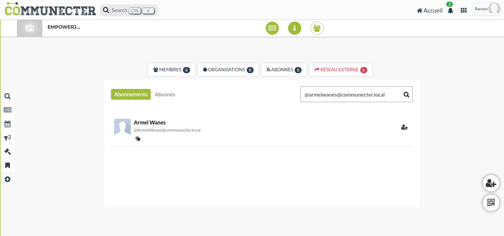

### 🎯 **Why Follow a Federated Organization?**
✔️ **Stay informed**: Receive all its news in real-time.
✔️ **Interact without restriction**: Comment, react, and participate in events, even if the organization is on another server.
✔️ **Facilitate collaboration**: Connect with similar structures and develop synergies beyond your own instance.
✔️ **Encourage transparency**: Organizations remain open and accessible to members of other communities.

## 🏗️ Available Actions for Organizations

Organization federation allows **flexible and dynamic management** of your structure on Communecter. Here are all available actions:

### 📌 **Creating and Managing an Organization**
✅ **Create an organization**: Launch and structure your own organization on the platform.
✅ **Update an organization**: Modify information and keep your organization up to date.
✅ **Manage roles and responsibilities**: Define administrators and active members to organize your structure.

### 👥 **Interaction with Members**
✅ **Invite users**: Send invitations to grow your community.
✅ **Accept an invitation**: Join organizations that interest you with one click.
✅ **Become a member of an organization**: Engage in collective projects and participate actively.
✅ **Leave an organization**: Manage your commitments freely.

### 🔑 **Role and Permission Management**
✅ **Assign roles**: Offer responsibilities to members based on their involvement.
✅ **Add an administrator**: Give other members the means to administer the organization.
✅ **Remove administrator privileges**: Review roles to ensure balanced management.
✅ **Accept an administrator request**: Authorize members to help manage the organization.

### 🗑️ **Moderation and Member Management**
✅ **Remove a member**: Maintain an effective and engaged team by regulating access.

## 🚀 Why Federate Organizations?

Organization federation allows for an **open, dynamic, and collaborative ecosystem**. It offers:

🔹 **An interconnected network**: Organizations are no longer limited to a single server.
🔹 **Better visibility**: Reach a wider audience beyond your local instance.

Thanks to Communecter, **your organizations are no longer isolated, they are part of a global and interconnected network!** 🌍💡

## 🏅 Badges Federation

Badges in Communecter are symbolic **rewards** awarded to users for their **contributions** and **engagement** within the community. These distinctions value positive actions and encourage active participation.

### 🤝 What is Badges Federation?
Badge federation allows users to **receive badges** from other Communecter instances and display them on their profile. This creates a network of shared recognition and engagement, where users' contributions are visible beyond their original instance.

Let's take the example of **Racoon** (kuun@mada-communecter.local) who receives a badge from **Armel Wanes**'s Communecter server (armelwanes@communecter.local).

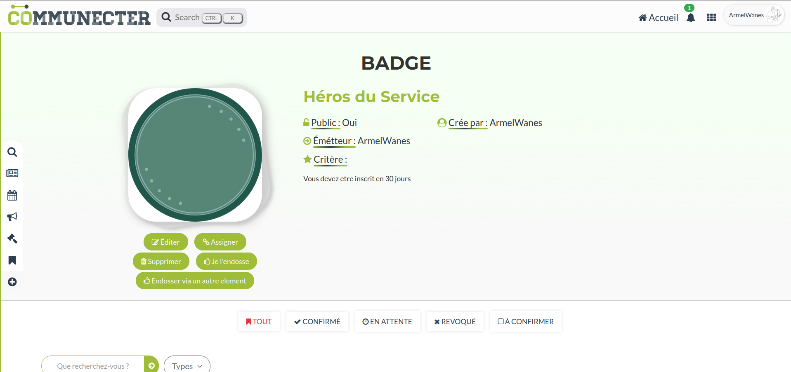

From Racoon, they can see the badge on their Communecter instance.

Unlike the badge display on Armel Wanes's instance, Racoon's is marked as a federated badge with the original instance information. Here it is marked "federated from communecter.local".

And we can assign a badge to a user from Armel Wanes's instance. And consequently, it will be visible on Racoon's server and vice versa, we can see it just below the badge.

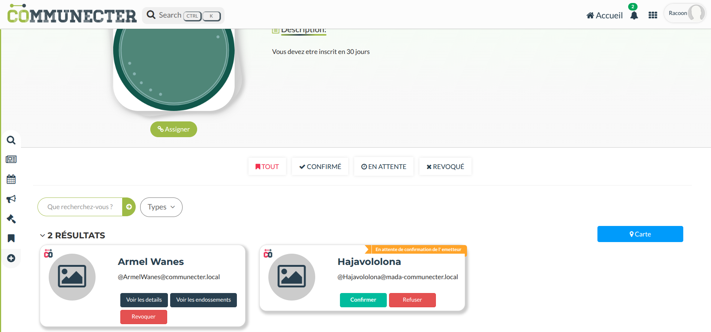
Fediverse users can see badges assigned to a user from Armel Wanes's instance from the fediverse, users who received the badge from the fediverse are specified by the fediverse icon just above the profile.

### 🛠️ Badge Management

When you receive a badge from another instance, it is **automatically added to your profile**, thus strengthening your reputation and visibility within the community. You can demonstrate your skills and engagement through badges that reflect your achievements.

### ✅ Available Functions for Badge Management

Badge federation offers several features to manage rewards given to users:

- **Badge creation**: Create custom badges to reward specific actions.
- **Badge update**: Modify details or criteria for awarding an existing badge.
- **Badge attribution**: Offer badges to users in recognition of their efforts.
- **Badge confirmation**: Validate badge attribution to ensure its authenticity.
- **Badge revocation**: Remove a badge in case of abuse or non-compliance with criteria.
- **Badge refusal**: Reject a badge attribution request if it doesn't meet standards.
- **Badge deletion**: Remove a badge from a user's history if necessary.
- **Self-attribution of badge**: Allow users to self-attribute badges based on their achievements.

### 🌟 Why Use Badge Federation?
Badge federation promotes:
🔹 **User interaction**: Badges from other instances strengthen connections and engagement.
🔹 **Recognition**: Each badge is a testimony to user involvement, which values their contributions.
🔹 **A dynamic community**: By rewarding users, we encourage active and collaborative participation.

With badge federation on Communecter, your efforts are **visible and valued**, creating an environment where every contribution counts and is recognized! 🏆

## 🌟 Projects

In Communecter, projects are **collaborative initiatives** that bring users together around common goals. Whether organizing an event, launching a campaign, or developing an idea, projects allow combining everyone's strengths and skills.

**Project federation** offers users the possibility to **follow and participate in projects** on other Communecter instances. This enriches the collaboration experience by enabling synergies between different communities.

Let's take the example of **Racoon** (kuun@mada-communecter.local) who follows a project by **Armel Wanes** (armelwanes@communecter.local).

From Racoon, they can see the project on their Communecter instance.

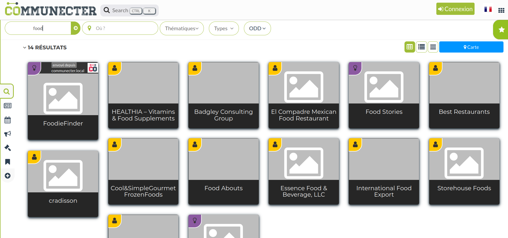

Unlike the project display on Armel Wanes's instance, Racoon's is marked as a federated project with the original instance information. Here it is marked "federated from communecter.local".
And if Racoon clicks on the project, they arrive on Armel Wanes's project page with a minimalist view and the project is marked as a federated project with the original instance information. Here it is marked "federated from communecter.local".

Like with organizations, we can invite a user to participate in a project from the fediverse.
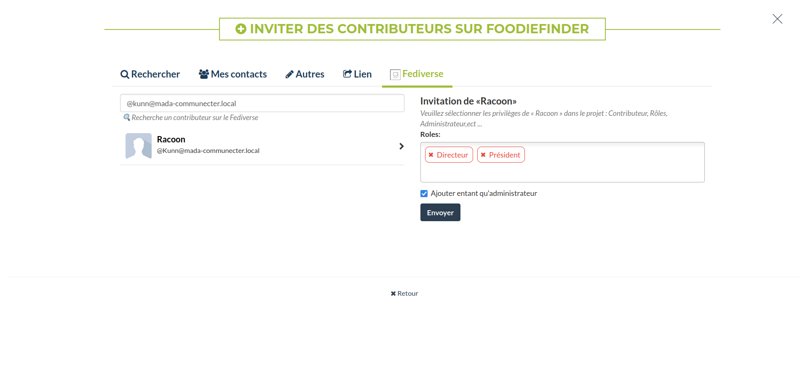

And in the "Contributors" section, project contributors are marked as federated with the original instance information. They are combined with Armel Wanes's project contributors. Conversely, if Armel Wanes removes a contributor from the "FoodFinder" project, this contributor will be removed from Racoon's organization and vice versa.

### 🛠️ Project Management

- **Project creation**: Launch collaborative projects by defining clear objectives.
- **Project update**: Modify project information to keep everyone informed of progress.
- **Project deletion**: Remove a project when it's no longer relevant or necessary.
- **Contributor invitation**: Invite other users to participate in your project to enrich available skills.
- **Become a contributor**: Engage in a project and bring your expertise or time.
- **Accept contribution request**: Validate requests from users wishing to join your project.
- **Accept administrator request**: Welcome members wishing to take management responsibilities.
- **Assign project roles**: Define contributor roles to structure responsibilities.
- **Add an administrator**: Give administration rights to trusted members to facilitate management.
- **Remove administrator privileges**: Review administration roles based on member engagement.
- **Leave a project**: Withdraw from a project if your priorities change.
- **Remove a contributor**: Maintain engagement by removing inactive members.
- **Request administration**: Allow users to request administrator rights on a project.
- **Follow a project**: Receive notifications and updates on project activities to stay informed.

### 🌍 Why Participate in Federated Projects?
Project federation promotes:
🔹 **Idea exchange**: Collaborate with users from other instances to enrich your projects.
🔹 **Skill synergy**: Gather varied talents to achieve common goals.
🔹 **Flexibility and openness**: Benefit from an adaptable and accessible project structure, regardless of which server you're on.

With Communecter, projects aren't just local; they're part of a global network, allowing each user to contribute to significant initiatives beyond instance boundaries. Together, let's advance our ideas and realize collective projects! 🚀

This presentation has allowed you to discover how federation works on Communecter, focusing on news, events, organizations, badges, and projects. We hope this will help you better understand and take advantage of these features.
